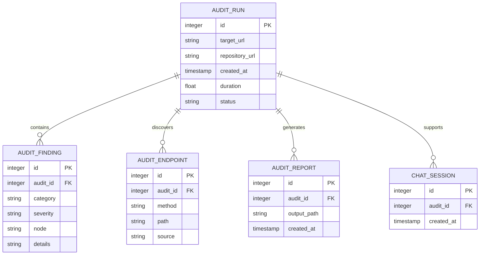

<h1 align="center">AuditAgent — AI-Powered Application Auditor</h1>

<p align="center">
  <strong>Audit a deployed application and its source repository to uncover broken links, performance bottlenecks, dependency risks, unreachable endpoints, and scalability issues — then turn the findings into actionable recommendations.</strong>
</p>

<p align="center">
  
  
  
  
  
</p>

---

## Table of Contents

1. [Problem Statement](#problem-statement)
2. [Our Solution](#our-solution)
3. [System Architecture](#system-architecture)
4. [Audit Pipeline](#audit-pipeline)
5. [Tech Stack](#tech-stack)
6. [Project Structure](#project-structure)
7. [Database Schema](#database-schema)
8. [Features](#features)
9. [API Reference](#api-reference)
10. [Getting Started](#getting-started)
11. [Environment Variables](#environment-variables)

---

## Problem Statement

Understanding whether a deployed application is healthy and scalable becomes difficult when:

- **Runtime and source code tell different stories** — A crawler only sees what is reachable through the deployed UI, while important API routes may remain hidden behind authentication or user actions.
- **Performance issues are hard to prioritize** — Slow pages, high-centrality nodes, and bottlenecks need to be evaluated together rather than as isolated errors.
- **Manual auditing is repetitive** — Checking links, endpoints, dependency relationships, and application behaviour across a project takes significant time.
- **AI needs structured context** — Feeding an LLM an entire application without preprocessing creates unnecessary noise and weakens the quality of architectural recommendations.

> **Result:** Important application risks can remain hidden, while developers spend time collecting and connecting audit data manually.

---

## Our Solution

**AuditAgent** combines deterministic application analysis, dependency-graph reasoning, and AI-assisted architectural recommendations:

| **Step** | **What Happens** |
|----------|------------------|
| **Crawl** | Visit the deployed application, discover pages and links, and collect response times, status codes, titles, console errors, and API activity |
| **Analyze** | Build a dependency graph and identify central nodes, bottlenecks, API cycles, broken links, and potential blast radius |
| **Inspect** | Clone the source repository and statically extract API endpoints defined by the application |
| **Merge** | Cross-reference endpoints observed at runtime with endpoints defined in the repository |
| **Recommend** | Retrieve relevant system-design patterns and use an LLM to produce prioritized scalability recommendations |
| **Report** | Generate a self-contained HTML audit report with findings, metrics, graph visualizations, and recommendations |
| **Ask** | Query the resulting audit through a grounded chatbot for questions about impact, bottlenecks, endpoints, and findings |

---

## System Architecture

```text
                         ┌──────────────────────────┐
                         │     URL + GitHub Repo    │
                         └────────────┬─────────────┘
                                      │
                                      ▼
                         ┌──────────────────────────┐
                         │       AuditAgent UI      │
                         │       React + Vite       │
                         └────────────┬─────────────┘
                                      │
                                      ▼
                         ┌──────────────────────────┐
                         │     FastAPI Backend      │
                         │       Job / API Layer    │
                         └────────────┬─────────────┘
                                      │
             ┌────────────────────────┼────────────────────────┐
             ▼                        ▼                        ▼
      ┌───────────────┐       ┌────────────────┐       ┌────────────────┐
      │ Web Crawler   │       │ Static Analysis│       │ Run History    │
      │ Playwright    │       │ Repo Endpoints │       │ SQLite / PG    │
      └───────┬───────┘       └───────┬────────┘       └────────────────┘
              │                       │
              └───────────┬───────────┘
                          ▼
                 ┌─────────────────────┐
                 │ Dependency Graph    │
                 │ NetworkX            │
                 └──────────┬──────────┘
                            │
                            ▼
                 ┌─────────────────────┐
                 │ Merge + Findings    │
                 │ Bottlenecks / Gaps  │
                 └──────────┬──────────┘
                            │
                 ┌──────────┴──────────┐
                 ▼                     ▼
        ┌─────────────────┐    ┌──────────────────┐
        │ RAG Retrieval   │    │ Report Generator │
        │ TF-IDF Patterns │    │ Self-contained   │
        └────────┬────────┘    │ HTML Report      │
                 │             └────────┬─────────┘
                 ▼                      │
        ┌─────────────────┐             ▼
        │ Architect Agent │      ┌────────────────┐
        │ Gemini / Claude │      │ URL Shortener  │
        └─────────────────┘      │ Go             │
                                 └────────────────┘
```

---

## Audit Pipeline

### Step 1: Runtime Crawling

The deployed application is explored using Playwright.

The crawler collects:

- HTTP status codes
- Response times
- Page titles
- Browser console errors
- Discovered links
- Observed API calls
- Broken links and failed pages

The crawler also respects `robots.txt` by default and normalizes duplicate URLs.

### Step 2: Dependency Graph

The crawl output is converted into a graph using **NetworkX**.

Nodes represent pages and API endpoints, while edges represent navigation and API-call relationships.

The graph is used to compute:

- Betweenness centrality
- Performance bottlenecks
- API call cycles
- Broken-link nodes
- Impact / blast-radius relationships

### Step 3: Static Repository Analysis

The source repository is inspected independently of the live crawl.

AuditAgent detects common route definitions across:

- Express / Node.js
- Flask
- FastAPI
- Django
- Next.js

This makes it possible to identify endpoints that exist in code but were never observed during the live crawl.

### Step 4: Runtime + Source Merge

Runtime observations and repository-defined endpoints are merged into a single representation:

```text
crawl_observed  → Reachable and observed live
repo_defined    → Exists in source but was not observed
both            → Confirmed in both source and runtime
```

### Step 5: AI Recommendations

Only the structured findings are passed to the AI layer.

A small TF-IDF retrieval layer selects relevant system-design patterns from a curated corpus before the Architect agent generates prioritized recommendations.

This keeps deterministic analysis separate from AI reasoning.

### Step 6: Report + Chat

The final pipeline produces a self-contained HTML report containing:

- Audit statistics
- Performance findings
- Dependency graph
- Endpoint gaps
- Concurrency findings
- Architectural recommendations

A grounded chatbot can then answer questions using the generated audit data and graph.

### Full Pipeline Flow

```text
Application URL + GitHub Repository
                │
                ▼
        ┌─────────────────┐
        │ Playwright Crawl│
        └────────┬────────┘
                 ▼
        ┌─────────────────┐
        │ Graph Analysis  │
        └────────┬────────┘
                 │
GitHub Repo ────►├──────────────────┐
                 ▼                  │
        ┌─────────────────┐         │
        │ Static Analysis │         │
        └────────┬────────┘         │
                 ▼                  │
        ┌─────────────────┐         │
        │ Merge Findings  │◄────────┘
        └────────┬────────┘
                 ▼
        ┌─────────────────┐
        │ RAG Retrieval   │
        └────────┬────────┘
                 ▼
        ┌─────────────────┐
        │ AI Recommendations
        └────────┬────────┘
                 ▼
        ┌─────────────────┐
        │ HTML Audit Report
        └────────┬────────┘
                 ▼
        Shareable Report + Chat
```

---

## Tech Stack

### Backend

| **Technology** | **Purpose** |
|----------------|-------------|
| **Python** | Core runtime and audit pipeline |
| **FastAPI** | REST API and job management |
| **Playwright** | Browser-based application crawling |
| **Requests** | HTTP requests and endpoint validation |
| **NetworkX** | Dependency graph construction and analysis |
| **Matplotlib** | Dependency graph visualization |
| **SQLite / PostgreSQL** | Audit run history and persistence |
| **Cryptography / Fernet** | Encryption of stored target credentials |

### AI & Analysis

| **Technology** | **Purpose** |
|----------------|-------------|
| **Google Gemini** | AI recommendations and conversational analysis |
| **Anthropic Claude** | Optional AI provider |
| **TF-IDF** | Lightweight retrieval over system-design patterns |
| **Curated RAG Corpus** | Architectural patterns used to ground recommendations |

### Frontend

| **Technology** | **Purpose** |
|----------------|-------------|
| **React** | Interactive audit dashboard |
| **Vite** | Frontend build tool |
| **JavaScript / JSX** | UI implementation |
| **CSS** | Dark-themed interface and animations |

### Supporting Services

| **Technology** | **Purpose** |
|----------------|-------------|
| **Go** | Lightweight URL shortener |
| **Render** | Backend deployment |
| **Vercel** | Frontend deployment |

---

## Project Structure

```text
AuditAgent/
├── auditagent/
│   ├── frontend/              # React + Vite frontend
│   ├── static/                # Zero-build HTML/CSS/JS frontend
│   ├── shortener/             # Go URL shortener
│   │
│   ├── crawler.py             # Runtime application crawler
│   ├── graph_engine.py        # Dependency graph + metrics
│   ├── static_analysis.py     # Source-level endpoint discovery
│   ├── merge.py               # Runtime/source graph merge
│   ├── architect.py           # AI scalability recommendations
│   ├── corpus.py              # System-design pattern corpus
│   ├── retrieval.py           # TF-IDF retrieval
│   ├── chatbot.py             # Audit-aware chatbot
│   ├── chat_context.py        # Chatbot graph/context tools
│   ├── report_generator.py    # Self-contained HTML reports
│   ├── orchestrator.py        # End-to-end pipeline
│   ├── api.py                 # FastAPI backend
│   ├── domain_verify.py       # Domain ownership verification
│   ├── active_tester.py      # Active API testing
│   ├── test_ledger.py         # Mutation tracking + rollback
│   ├── active_test_report.py  # Active-test reporting
│   ├── unified_report.py      # Unified audit output
│   ├── code_reviewer.py       # Source/code review
│   ├── auth.py                # Authentication
│   ├── db.py                  # Persistence layer
│   ├── credentials.py         # Credential encryption
│   ├── requirements.txt
│   └── render.yaml
│
└── .gitignore
```

---

## Database Schema

AuditAgent stores run history and audit metadata using a relational database layer.

The local development configuration can use SQLite, while production can use PostgreSQL.



---

## Features

### Application Auditing

- **Live Application Crawling** — Explore deployed applications using a real browser
- **Broken Link Detection** — Identify links returning errors or failing to resolve
- **Performance Monitoring** — Detect slow pages and response-time issues
- **Console Error Detection** — Surface browser-side errors during crawling
- **API Observation** — Capture API calls made during the live crawl

### Dependency Analysis

- **Dependency Graph** — Model pages and API endpoints as connected graph nodes
- **Centrality Analysis** — Identify high-impact application components
- **Bottleneck Detection** — Surface highly central nodes that are also slow
- **Cycle Detection** — Identify potentially problematic API call cycles
- **Blast-Radius Analysis** — Determine what parts of an application depend on a selected node

### Source-Level Auditing

- **Static Endpoint Discovery** — Extract routes directly from source code
- **Multi-Framework Support** — Express, Flask, FastAPI, Django, and Next.js
- **Runtime vs. Source Comparison** — Detect endpoints defined in code but never observed live
- **Repository Analysis** — Audit application structure beyond what the UI exposes

### AI & Recommendations

- **Grounded Recommendations** — AI receives structured findings rather than raw application data
- **Pattern Retrieval** — TF-IDF retrieval selects relevant system-design patterns
- **Scalability Recommendations** — Prioritized recommendations based on measured findings
- **Audit Chatbot** — Ask questions about bottlenecks, dependencies, endpoints, and impact

### Reporting & Delivery

- **Self-Contained HTML Reports** — Package findings, graphs, metrics, and recommendations into one report
- **Run History** — Persist previous audit runs and compare repeated tests
- **Shareable Reports** — Generate short URLs for report sharing
- **Health Summary** — Surface important findings through an at-a-glance application health score
- **Interactive Dashboard** — Track audit progress through the web interface

### Safe Auditing

- **Domain Ownership Verification** — Verify ownership before enabling the active concurrency probe
- **Robots.txt Support** — Respect crawler restrictions by default
- **Test Ledger** — Track mutating API actions during active testing
- **Rollback Support** — Apply compensating actions to restore tested resources where possible
- **Credential Encryption** — Encrypt stored target-site credentials at rest

---

## API Reference

### Audit

| **Method** | **Endpoint** | **Description** |
|------------|--------------|-----------------|
| `POST` | `/api/audits` | Start a new application audit |
| `GET` | `/api/audits/{id}` | Get audit progress and status |
| `GET` | `/api/audits/{id}/report` | Retrieve the generated audit report |

### History

| **Method** | **Endpoint** | **Description** |
|------------|--------------|-----------------|
| `GET` | `/api/history` | Retrieve previous audit runs |
| `GET` | `/api/history/report` | Open a report from a previous run |
| `GET` | `/api/stats` | Retrieve aggregate audit statistics |

### Chat

| **Method** | **Endpoint** | **Description** |
|------------|--------------|-----------------|
| `POST` | `/api/chat` | Ask a question about a completed audit |

### Domain Verification

| **Method** | **Endpoint** | **Description** |
|------------|--------------|-----------------|
| `POST` | `/api/verify/start` | Start domain ownership verification |
| `POST` | `/api/verify/check` | Check domain verification status |

---

## Getting Started

### Prerequisites

- **Python 3.10+**
- **Git**
- **Playwright + Chromium**
- **Node.js 18+** for the React frontend
- **Gemini API key** or **Anthropic API key** for AI features

### 1. Clone the Repository

```bash
git clone https://github.com/GaliAkshatha/AuditAgent.git
cd AuditAgent/auditagent
```

### 2. Create a Virtual Environment

```bash
python -m venv venv
```

Activate it:

```bash
# Windows
venv\Scripts\activate

# macOS / Linux
source venv/bin/activate
```

### 3. Install Dependencies

```bash
pip install -r requirements.txt
playwright install chromium
```

### 4. Configure Environment Variables

Create `.env` from `.env.example`:

```bash
cp .env.example .env
```

For Windows PowerShell:

```powershell
Copy-Item .env.example .env
```

At minimum, configure:

```env
GEMINI_API_KEY=your_gemini_api_key
```

### 5. Run the Backend

```bash
uvicorn api:app --reload --port 8000
```

### 6. Run the React Frontend

In a second terminal:

```bash
cd frontend
npm install
npm run dev
```

Open:

```text
http://localhost:5173
```

### CLI Usage

The complete pipeline can also be run directly:

```bash
python orchestrator.py https://example.com --repo https://github.com/user/repo
```

With an explicit API base URL:

```bash
python orchestrator.py https://example.com \
  --repo https://github.com/user/repo \
  --api-base-url https://api.example.com
```

---

## Environment Variables

### Backend (`.env`)

| **Variable** | **Default** | **Description** |
|--------------|-------------|-----------------|
| `GEMINI_API_KEY` | — | Gemini API key for AI recommendations and code review |
| `DATABASE_URL` | SQLite fallback | PostgreSQL connection string for production |
| `SESSION_SECRET_KEY` | Auto-generated locally | Secret used for session cookies |
| `CREDENTIALS_MASTER_KEY` | Auto-generated locally | Fernet key used to encrypt stored target credentials |
| `FRONTEND_URL` | — | Deployed frontend URL allowed by CORS |

### AI Providers

AuditAgent supports both Gemini and Anthropic for AI-powered components.

```env
GEMINI_API_KEY=your_gemini_api_key
```

or:

```env
ANTHROPIC_API_KEY=your_anthropic_api_key
```

---

<p align="center">
  Built by <a href="https://github.com/GaliAkshatha">Akshatha Gali</a>
</p>
